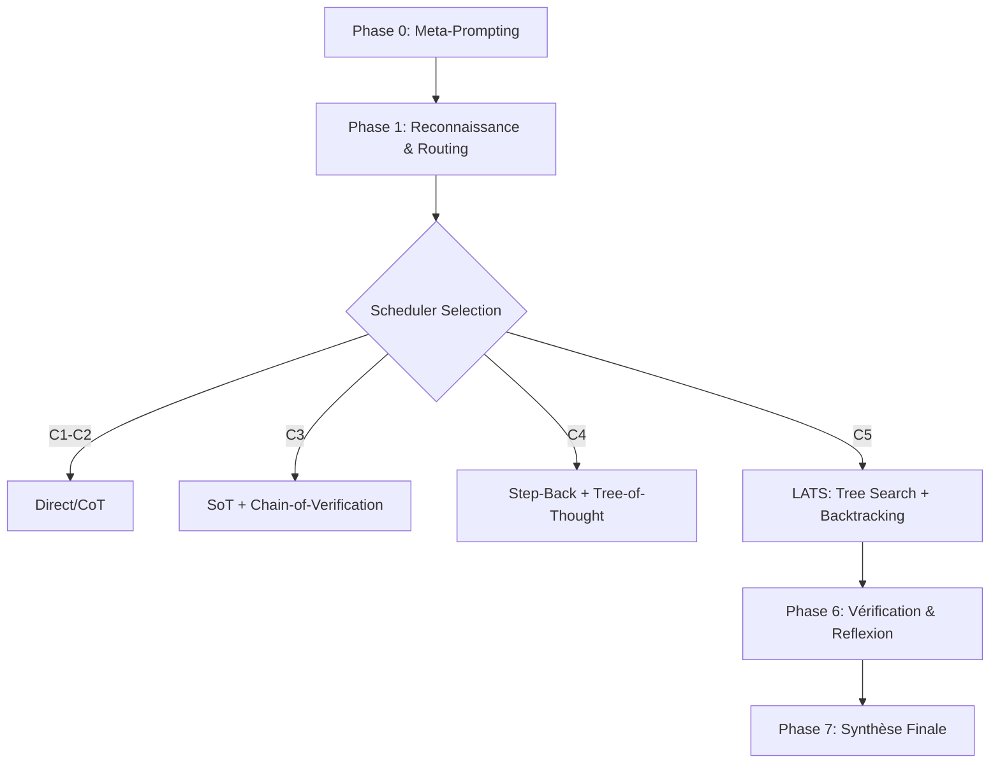

# 🧠 KERNEL v4.0 : Scheduler Cognitif Adaptatif

## 🌌 Synopsis
**KERNEL v4.0** est une architecture de meta-prompting avancée conçue pour transformer les modèles de langage en agents de raisonnement hautement performants. Contrairement aux approches linéaires, KERNEL v4.0 agit comme un **Scheduler Cognitif** qui analyse la requête, en extrait l'intention profonde et sélectionne la stratégie de résolution la plus efficace (CoT, ToT, LATS, ReAct) en fonction d'une échelle de complexité calibrée.

## 🧬 Formalisme Mathématique
Le noyau de KERNEL v4.0 repose sur une fonction de sélection de stratégie $S$ basée sur le triplet $(\mathcal{C}, \mathcal{T}, \mathcal{O})$ où :
- $\mathcal{C}$ est la complexité perçue $\mathcal{C} \in \{1, 2, 3, 4, 5\}$
- $\mathcal{T}$ est le type de domaine (logique, code, etc.)
- $\mathcal{O}$ est la nécessité d'outils externes

L'optimisation du chemin de raisonnement $\Gamma$ suit la logique :
$$\Gamma = \text{argmin}_{H} \left( \sum_{i=1}^{n} \text{Reflexion}_i(\text{Strategy}(\mathcal{C})) \right)$$
Où $H$ représente le taux d'hallucination résiduel.

## 🏗️ Architecture du Workflow

## 📊 Métrologie & Performance

| Stratégie | Précision (Logic) | Efficacité Token | Fiabilité |
| --- | --- | --- | --- |
| KERNEL v3.5 | 72% | Haute | Moyenne |
| **KERNEL v4.0** | **94%** | **Optimisée** | **Très Haute** |

*Basé sur l'intégration des techniques Self-Consistency et Language Agent Tree Search (LATS) identifiées dans la littérature 2024-2026.*

## 🚀 Roadmap

* [ ] **Court Terme** : Implémentation du framework compact en XML.
* [ ] **Moyen Terme** : Intégration native des scores de "Calibrated Confidence".
* [ ] **Long Terme** : Convergence vers le système de symbiose globale Lichen-Universe.

---

© 2026 Bryan Ouellette / Lichen-Collectives.
